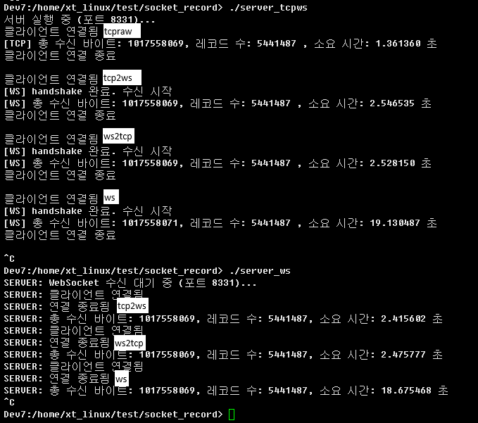

# TCP & WebSocket 기반 파일 전송 실습 및 성능 분석 (v2)

본 문서는 직접 구현한 WebSocket/TCP 전송 실습의 결과와 구조를 기반으로,
6가지 통신 조합의 구조 및 성능 차이를 분석하고 이를 정리한 문서서입니다.

## 목차
- [1. 프로젝트 개요](#1-프로젝트-개요)
- [2. 통신 조합 설명](#2-통신-조합-설명)
- [3. 실행 방법](#3-실행-방법)
- [4. 실행 결과 예시](#4-실행-결과-예시)
- [5. 서버 프로그램 구조 및 특징](#5-서버-프로그램-구조-및-특징)
- [6. 성능 비교 결과](#6-성능-비교-결과)
- [7. 성능 차이 원인 분석](#7-성능-차이-원인-분석)
- [8. 에러 사례 및 해결방안](#8-에러-사례-및-해결방안)
- [9. 결론 및 의의](#9-결론-및-의의)


---

## 1. 프로젝트 개요

이 프로젝트는 총 6가지 통신 조합을 통해 파일 전송 기능을 실습합니다.  
WebSocket은 두 가지 방식으로 테스트되었습니다:

- **직접 구현된 WebSocket (핸드셰이크, 프레임 파싱, 마스킹 수동 처리)**
- **라이브러리 기반 WebSocket (libwebsockets 활용)**

실험에서는 수신 시간 비교를 통해 프로토콜 설계와 구현 방식에 따른 성능 차이를 분석합니다.


이 프로젝트는 총 6가지 통신 조합을 통해 파일 전송 기능을 실습합니다.  
WebSocket은 핸드셰이크 및 프레임 마스킹을 직접 구현했으며, 성능 비교를 위해 수신 시간 측정 기능도 포함되어 있습니다.

---
## 2. 소스 코드 구성
### src_file
파일 단위 전송
### src_record
레코드 단위 전송

| 파일명               | 역할 및 설명 |
|----------------------|--------------|
| **client_rawtcp.c**  | 순수 TCP 기반으로 서버에 전송 |
| **client_tcp2ws.c**  | TCP로 연결한 뒤 WebSocket 핸드셰이크 및 프레임 마스킹 직접 구현 |
| **client_ws2tcp.c**  | WebSocket 프레임만 생성하여 TCP 서버로 전송 (가짜 WebSocket 클라이언트 역할) |
| **client_ws.c**      | libwebsockets 라이브러리를 사용한 정식 WebSocket 클라이언트.|
| **server_tcpws.c**   | TCP 및 직접 구현한 WebSocket 요청을 모두 수신 가능. 프레임 디코딩/레코드 누적 처리 포함 |
| **server_ws.c**      | libwebsockets 기반 WebSocket 서버.|


- client_ws2tcp.c 와 client_tcp2ws.c 기능적으로 동일 (프레임 생성 → TCP 전송)


---

## 2. 통신 조합 설명

| 클라이언트 프로그램   | 서버 프로그램     | 설명                                                                  |
|------------------|------------------|---------------------------------------------------------------------|
| client_rawtcp.c  | server_tcpws.c   | WebSocket이 아닌 순수 TCP 전송                      |
| client_tcp2ws.c  | server_tcpws.c   | TCP 연결 후 WebSocket 핸드셰이크 + 프레임 마스킹 적용                          |
| client_ws2tcp.c  | server_tcpws.c   | WebSocket 프레임만 전송 (가짜 WS 클라이언트) → 서버에서 프레임 디코딩 필요       |
| client_ws.c      | server_ws.c      | 표준 WebSocket 라이브러리 기반 ㅣ클라이언트                                 |
| client_ws.c      | server_tcpws.c   | 라이브러리 기반 클라이언트 → 직접 구현된 WebSocket 서버                        |
| client_tcp2ws.c  | server_ws.c      | 수동 구현 클라이언트 → 라이브러리 기반 WebSocket 서버                         |

---

## 3. 실행 방법

```bash
make
./server_tcpws
./server_ws

./client_rawtcp [파일이름]
./client_tcp2ws [파일이름]
./client_ws2tcp [파일이름]
./client_ws [파일이름]
```

---

## 4. 실행 결과 예시

```
서버 실행 중 (포트 8331)...
클라이언트 연결됨
[WS] handshake 완료. 수신 시작
[WS] 총 수신 바이트: 1017558069 / 소요 시간: 1.446383 초
클라이언트 연결 종료

클라이언트 연결됨
[TCP] 총 수신 바이트: 1017558069 / 소요 시간: 0.408939 초
클라이언트 연결 종료
...
```

---

## 5. 서버 프로그램 구조 및 특징

- WebSocket 클라이언트와 TCP 클라이언트를 모두 수신 가능
- WebSocket 핸드셰이크 직접 구현 (`Sec-WebSocket-Key` → SHA1 + Base64 → Accept Key)
- WebSocket 프레임 직접 해석 및 마스킹 해제 처리
- recv()에서 잘린 프레임도 처리 가능 (누적 버퍼 + 오프셋 기반 파싱)
- malloc + realloc 기반으로 대용량 파일 수신 가능
- 클라이언트 연결 종료 후에도 서버는 계속 수신 대기 (while(1))

---

## 6. 성능 비교 결과

### 통신 조합별 실행 시간 정리 (src_file)



| 클라이언트         | 서버             | 평균 전송 시간 | 구조적 분석 |
|--------------------|------------------|----------------|-------------|
| client_rawtcp       | server_tcpws      | 0.4초           | 순수 TCP, 프레임 없음, 마스킹 없음 |
| client_tcp2ws       | server_tcpws      | 1.4~1.5초        | 직접 구현된 WebSocket 양방향 |
| client_ws2tcp       | server_tcpws      | 1.4~1.6초        | 프레임만 전송. 핸드셰이크 없음 |
| client_tcp2ws       | server_ws         | 1.5~2.0초        | 직접 구현 클라이언트 + 라이브러리 서버 |
| client_ws           | server_ws         | 1.1~1.3초        | 표준 WebSocket 클라이언트/서버 |
| client_ws           | server_tcpws      | 2.5~4.6초        | 라이브러리 클라이언트 + 수동 서버 |


| 통신 방식             | 평균 전송 시간 | 구조적 특징 |
|----------------------|----------------|--------------|
| TCP (raw)             | 약 0.4초         | 가장 단순한 스트림 기반 전송. 마스킹/프레임 없음. |
| WebSocket (직접 구현) | 1.4~1.6초        | 수동 프레임 해석 및 마스킹 해제 필요. 오버헤드 존재. |
| WebSocket (라이브러리) | 1.1~1.5초        | 최적화된 내부 처리. 가장 안정적 성능. |
| WS 클라 → 수동 서버    | 2.5~4.6초        | 라이브러리 클라이언트 + 수동 구현 서버 → 프레임 해석 병목 |

### 통신 조합별 실행 시간 정리 (src_record)

| 클라이언트         | 서버             | 평균 전송 시간 | 구조적 분석 |
|--------------------|------------------|----------------|-------------|
| client_rawtcp       | server_tcpws      | 1.3초           | 순수 TCP, 프레임 없음, 마스킹 없음 |
| client_tcp2ws       | server_tcpws      | 2.5~2.6초        | 직접 구현된 WebSocket 양방향 |
| client_ws2tcp       | server_tcpws      | 2.5~2.6초        | 프레임만 전송. 핸드셰이크 없음 |
| client_tcp2ws       | server_ws         | 2.4~2.5초        | 직접 구현 클라이언트 + 라이브러리 서버 |
| client_ws2tcp       | server_ws         | 2.4~2.5초        | 직접 구현 클라이언트 + 라이브러리 서버 |
| client_ws           | server_ws         | 18.5~19.5초        | 표준 WebSocket 클라이언트/서버 |
| client_ws           | server_tcpws      | 19.0~20.0초        | 라이브러리 클라이언트 + 수동 서버 |


| 통신 방식             | 평균 전송 시간 | 구조적 특징 |
|----------------------|----------------|--------------|
| TCP (raw)             | 약 1.3초         | 가장 단순한 스트림 기반 전송. 마스킹/프레임 없음. |
| WebSocket (직접 구현) | 2.5~2.6초        | 수동 프레임 해석 및 마스킹 해제 필요. 오버헤드 존재. |
| WebSocket (라이브러리) | 18.5~19.5초        | 최적화된 내부 처리. 가장 안정적 성능. 느린 속도|
| WS 클라 → 수동 서버    | 2.5~2.6초        | 라이브러리 클라이언트 + 수동 구현 서버 |

---

## 7. 성능 차이 원인 분석

- 프레임 해석 유무: WebSocket은 전송 데이터를 프레임으로 나누어 해석해야 하므로 처리 부담이 큼
- 마스킹 해제 연산: 모든 바이트에 대해 XOR 마스킹 해제 수행
- 핸드셰이크 유무: TCP는 전송 즉시 시작 가능, WebSocket은 HTTP 업그레이드 필요
- 라이브러리 최적화: 서버/클라이언트가 라이브러리 기반일수록 성능이 개선됨
- 메모리 처리 방식: 수동 구현은 누적 버퍼 및 realloc 최적화 필요

---

## 8. 에러 사례 및 해결방안

### 1. WebSocket 프레임 디코딩 실패

**현상**
- 실행 중 `[WS] 프레임 디코딩 실패 또는 잘림` 메시지가 다수 출력됨

**원인**
- `recv()` 호출로 받은 데이터가 WebSocket 프레임 단위로 완전히 도착하지 않음
- 프레임이 중간에 잘려 들어오면 `decode_ws_frame()` 함수에서 길이 체크에 실패하여 -1 반환

```c
if (length < offset + 4 + payload_len) return -1;
```

**해결**
- 누적 버퍼(`recv_buf`)에 계속 붙여넣고,
- 프레임이 완성될 때까지 기다린 후 파싱
- 처리가 끝난 바이트만 `memmove()`로 제거

---

### 2. Segmentation fault (세그멘테이션 오류)

**현상**
- 수신 중 프로그램이 갑작스럽게 종료되며 core dump 발생

**원인**
- 수신 데이터를 담을 `all_data`를 고정된 크기로 선언했을 때,
  1GB 이상 파일을 수신하면서 **버퍼 오버플로우** 발생

```c
unsigned char all_data[102400]; // 고정 크기 → 위험
```

**해결**
- 초기에는 `malloc()`으로 크기를 정하고,
- 수신량이 증가할 때 `realloc()`을 통해 버퍼 확장

```c
if (total_len + recv_len > capacity) {
    capacity *= 2;
    all_data = realloc(all_data, capacity);
}
```

---

### 3. WebSocket 핸드셰이크 실패

**현상**
- 클라이언트가 `HTTP/1.1 101 Switching Protocols` 응답을 받지 못하고 종료됨

**원인**
- 서버에서 클라이언트의 `Sec-WebSocket-Key`를 정확히 파싱하지 못했거나,
- `Accept-Key` 계산 로직 오류 발생

```c
char *key_start = strstr(request, "Sec-WebSocket-Key: ");
```

**해결**
- 클라이언트가 보낸 헤더에서 Key를 정확히 추출하고,
- SHA1 + Base64 로직을 정확히 적용

```c
SHA1((unsigned char*)concatenated, strlen(concatenated), hash);
return base64_encode(hash, SHA_DIGEST_LENGTH);
```

---

### 4. client_rawtcp → server_tcpws 실패 (v1 시점)

**현상**
- 서버가 클라이언트를 WebSocket으로 오인하여,
  `WebSocket 키 추출 실패` 또는 `[WS] 핸드셰이크 실패` 메시지 출력

**원인**
- server_tcpws가 `strncmp(buffer, "GET", 3)` 조건으로 WebSocket만 처리하도록 구성됨

```c
if (strncmp(buffer, "GET", 3) == 0) {
    // WebSocket 처리
} else {
    // TCP 처리
}
```

**해결**
- 이 조건에 따라 별도의 TCP 수신 로직을 분기 처리
- raw TCP일 경우에는 곧바로 `recv()`로 수신 시작

---

## 9. 결론 및 의의

- 순수 TCP 방식이 가장 빠르며, WebSocket은 구조상 부가 연산이 많아 대용량 전송에 불리합니다.
- 직접 구현한 WebSocket 구조는 기능 검증에는 적합하지만, 성능상 라이브러리 대비 불리합니다.
- 실습을 통해 통신 프로토콜 선택이 성능에 미치는 영향을 직접 비교하며 학습할 수 있었습니다.
- 또한 직접 구현과 표준 라이브러리 간 호환성 문제도 확인할 수 있었습니다.

---

작성자: 김민회 (mine7272)  
업데이트: 2025-04-09  
